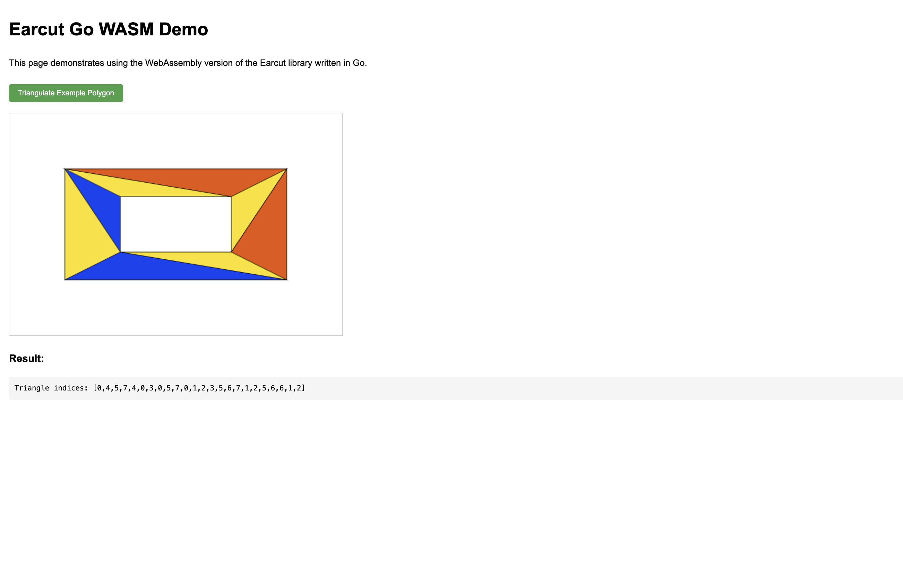

# Earcut-Go WebAssembly


This directory contains files related to compiling Earcut-Go to WebAssembly and calling it from JavaScript.

## File Description

- `main.go` - Go code entry point, exporting the Earcut function as WebAssembly
- `build.sh` - Compilation script for compiling Go code to WebAssembly
- `serve.sh` - Starts a simple HTTP server to serve the WASM file
- `index.html` - Example HTML page demonstrating how to use the WASM version of Earcut

## Running the Example

1. Start the HTTP server:

```bash
chmod +x serve.sh
./serve.sh
```

2. Visit http://localhost:8000 in your browser

## Compilation Steps

1. Ensure you have Go 1.16 or higher installed (this project was developed with Go 1.24.1)
2. Run the compilation script:

```bash
chmod +x build.sh
./build.sh
```

This will generate the following files:
- `main.wasm` - The compiled WebAssembly file
- `wasm_exec.js` - JavaScript glue code provided by Go

## Using in Your Own Project

To use Earcut-Go WebAssembly in your own JavaScript project, you need to:

1. Copy the `main.wasm` and `wasm_exec.js` files to your project
2. Include `wasm_exec.js` in your HTML:

```html
<script src="wasm_exec.js"></script>
```

3. Load and initialize WebAssembly:

```javascript
const go = new Go();
WebAssembly.instantiateStreaming(fetch("main.wasm"), go.importObject)
    .then((result) => {
        go.run(result.instance);
        console.log("WASM loaded");
    });
```

4. Call the Earcut function:

```javascript
// Polygon vertices array [x0, y0, x1, y1, ...]
const data = [0, 0, 100, 0, 100, 100, 0, 100];

// Optional: hole indices array
const holeIndices = [];

// Optional: dimension (default is 2)
const dim = 2;

// Call the earcut function in WASM
const triangles = earcutGo(data, holeIndices, dim);
console.log(triangles); // Triangle indices array
```

## API Description

`earcutGo(data, holeIndices, dim)`

- `data`: Vertex coordinate array in the format [x0, y0, x1, y1, ...]
- `holeIndices`: Array of starting indices for holes, e.g., [5, 10] means vertices starting at indices 5 and 10 are the starting points of two holes
- `dim`: Dimension of each vertex coordinate, default is 2

Return value: Array of triangle indices, where every three indices represent one triangle 