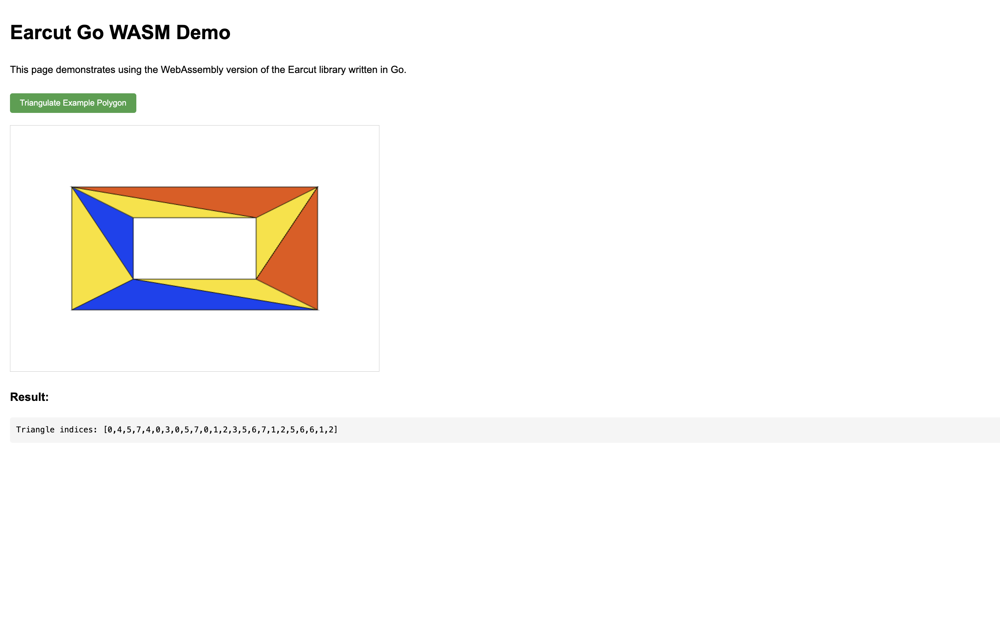

# Earcut-Go WebAssembly

这个目录包含了将 Earcut-Go 编译为 WebAssembly 并通过 JavaScript 调用的相关文件。

## 文件说明

- `main.go` - Go 代码入口点，将 Earcut 函数导出为 WebAssembly
- `build.sh` - 编译脚本，用于将 Go 代码编译为 WebAssembly
- `serve.sh` - 启动一个简单的 HTTP 服务器，用于提供 WASM 文件
- `index.html` - 示例 HTML 页面，演示如何使用 WASM 版本的 Earcut

## 运行示例

1. 启动 HTTP 服务器：

```bash
chmod +x serve.sh
./serve.sh
```

2. 在浏览器中访问 http://localhost:8000

## 编译步骤

1. 确保您已安装 Go 1.16 或更高版本（本项目使用 Go 1.24.1 开发）
2. 运行编译脚本：

```bash
chmod +x build.sh
./build.sh
```

这将生成以下文件：
- `main.wasm` - 编译后的 WebAssembly 文件
- `wasm_exec.js` - Go 提供的 JavaScript 胶水代码

## 在您自己的项目中使用

要在您自己的 JavaScript 项目中使用 Earcut-Go WebAssembly，您需要：

1. 复制 `main.wasm` 和 `wasm_exec.js` 文件到您的项目中
2. 在 HTML 中引入 `wasm_exec.js`：

```html
<script src="wasm_exec.js"></script>
```

3. 加载并初始化 WebAssembly：

```javascript
const go = new Go();
WebAssembly.instantiateStreaming(fetch("main.wasm"), go.importObject)
    .then((result) => {
        go.run(result.instance);
        console.log("WASM 已加载");
    });
```

4. 调用 Earcut 函数：

```javascript
// 多边形顶点数组 [x0, y0, x1, y1, ...]
const data = [0, 0, 100, 0, 100, 100, 0, 100];

// 可选：洞的索引数组
const holeIndices = [];

// 可选：维度 (默认为 2)
const dim = 2;

// 调用 WASM 中的 earcut 函数
const triangles = earcutGo(data, holeIndices, dim);
console.log(triangles); // 三角形索引数组
```

## API 说明

`earcutGo(data, holeIndices, dim)`

- `data`: 顶点坐标数组，格式为 [x0, y0, x1, y1, ...]
- `holeIndices`: 洞的起始索引数组，例如 [5, 10] 表示从索引 5 和 10 开始的顶点分别是两个洞的起始点
- `dim`: 每个顶点的坐标维度，默认为 2

返回值：三角形索引数组，每三个索引表示一个三角形